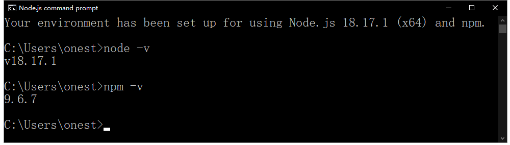

# 第 1 课：Node.js 简介

## 阅读参考资料

- [Node.js 官方网站](https://nodejs.org/)
- [Node.js 官方 API](https://nodejs.org/dist/latest-v18.x/docs/api/)
- [Node.js 中文 API](https://nodejs.cn/dist/latest-v18.x/docs/api/)

## 下载并浏览电子书

- 电子书网盘链接：http://pan.baidu.com/s/1nuU6C8h 密码: h6jc

## 搭建开发环境

**在 windows 上安装 Node.js**

- 下载 [Node.js msi 安装包](https://nodejs.org/dist/v18.17.1/node-v18.17.1-x64.msi)
- 运行 Node.js msi 安装包
- 从开始菜单，运行 `Node.js command prompt`
- 运行命令 `node -v`
- 运行命令 `npm -v`
- 确保软件安装成功，如下图所示

**方式一：导入虚拟机（推荐）**

- 下载并安装 vmware workstation Pro 15+（**已经安装 vmware workstation，跳过此步**）
- 下载 [mocha 虚拟机](http://pan.baidu.com/s/1o8a3E3o)压缩文件
- 解压缩 mocha 虚拟机
- 用 vmware workstation，打开解压后的 mocha 虚拟机
- 启动 mocha 虚拟机
- 登录 mocha 虚拟机，用户名：wangding，密码：ddd
- 配置 mocha 虚拟机的网卡 IP 地址，具体操作请参考：[教学视频](https://www.bilibili.com/video/bv1iy4y1y7hm)
- 确保在 mocha 虚拟机中，`ping www.baidu.com` 可以正常执行
- 下载并安装 [xshell](https://www.xshell.com/zh/free-for-home-school/)
- 用 XShell 链接 mocha 虚拟机

**方式二：从头安装**

- 安装步骤请参考：[Node.js 开发环境搭建](setup-dev-env.html)
- 安装 CentOS 虚拟机，请参考：[教学视频](http://edu.51cto.com/center/course/lesson/index?id=166501)

## 配置开发环境

**4.1 配置 git 参数**

- 配置 git 的 user.name 和 user.email 参数，否则 `git commit` 不能正常工作
- 运行命令 `git config --list`，查看当前的 git 配置信息
- 如果没有配置 user.name 和 user.email 参数，请执行下面的操作
- 运行命令 `git config --global user.email "Your Email"`，配置 user.name 参数
- 运行命令 `git config --global user.name "Your Name"`，配置 user.email 参数
- 注意，上面两个命令需要把双引号中的文字改成具体的姓名和邮箱
- 运行命令 `git config --list`，查看刚配置的 git 参数

## 熟悉开发环境的使用

- 熟悉[开发环境的使用](./env-manual.md)
- 熟悉常用的 [linux 命令用法](http://note.wangding.co/linux/centos.html)
- 熟悉 [Git 命令](http://note.wangding.co/office/git.html)的用法
- 熟悉 [vim 的用法](http://note.wangding.co/office/vim.html)
- 可以选择观看[课程视频](./video.md)来熟悉开发环境

## 命令行程序

要求：

- 创建 nodejs-demo 目录
- 把 .tern-project 代码自动补全配置文件，放到 nodejs-demo 目录下，操作方法如下：
  - 在 nodejs-demo 目录下，运行 `wget http://sample.wangding.co/nodejs/tern-project`
  - 在 nodejs-demo 目录下，运行 `mv tern-project .tern-project`
- 创建 01-introduction 目录
- 编写 01-hello-world.js
- 在命令行打印 `hello world!` 字符

## web 服务程序

版本 1 要求：

- 编写 02-hello-world-server.js
- 监听端口：8080
- 当收到 HTTP 请求时，发送响应文本 `Hello world!`
- 代码风格是 `createSever` 方法和 `listen` 方法的链式调用
- 用浏览器测试 web 程序
- 用 curl linux 命令行程序测试 web 程序

版本 2 要求：

- 编写 03-hello-world-server.js
- 监听端口：8080
- 当收到 HTTP 请求时，发送响应文本 `Hello world!`
- 代码风格是首先调用 `createSever` 方法创建的服务对象
- 其次，监听服务对象的 `request` 事件
- 最后，调用服务对象的 `listen` 方法
- 用浏览器测试 web 程序
- 用 curl linux 命令行程序测试 web 程序

## windows 窗口程序

要求：
- 下面的操作都在 windows 操作系统上完成
- 克隆 rectangle-frm 仓库，`git clone https://wngding@bitbucket.org/wngding/rectangle-frm.git`
- 运行 `Node.js command prompt`
- 进入 rectangle-frm 项目文件夹
- 安装项目依赖，`npm install`
- 运行 windows 应用程序，`npm start`
- 查看项目目录下的代码文件
