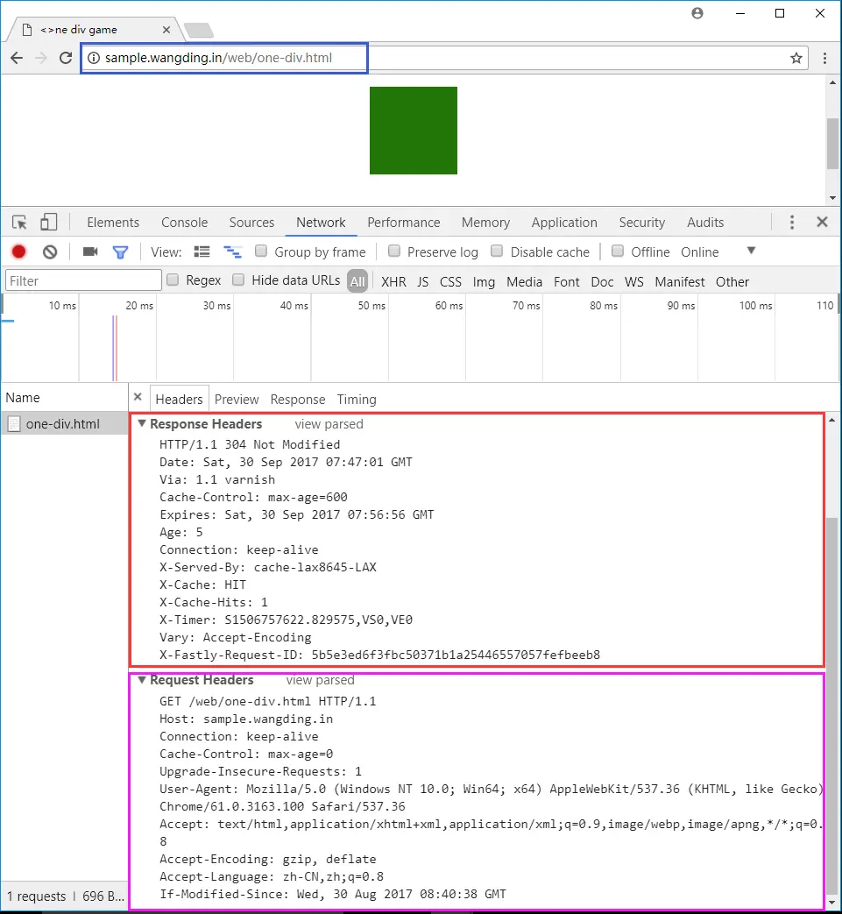
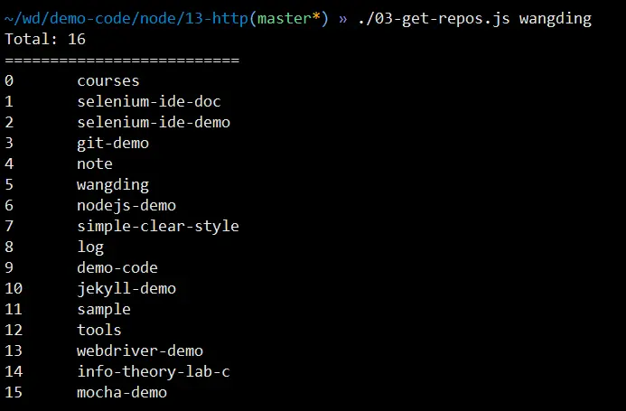

# 第 10 课：HTTP 网络编程（客户端）

## 阅读 Node.js API 资料

- [http API 资料](https://www.nodeapp.cn/http.html)

## 了解 HTTP 协议

要求：

- HTTP 协议相关的知识主要包括：
  - HTTP 命令，包括：GET、POST，等
  - HTTP 报文，包括：请求报文头，请求报文体、响应报文头和响应报文体
  - HTTP 响应状态码
- 阅读 [HTTP 协议资料](https://developer.mozilla.org/zh-CN/docs/Web/HTTP)
- 阅读 [HTTP 头部字段资料](https://developer.mozilla.org/zh-CN/docs/Web/HTTP/Headers)
- 阅读 [HTTP 状态码资料](https://developer.mozilla.org/zh-CN/docs/Web/HTTP/Status)
- 用 telnet 工具了解 HTTP 协议的相关知识
- 用 curl 工具了解 HTTP 协议的相关知识
- 用 chrome 开发者工具了解 HTTP 协议的相关知识
- 用上面三个工具访问 http://sample.wangding.co/web/one-div.html ，查看请求和响应的头信息，如下图所示：
- 搞明白请求头部字段列表中每个字段的含义和作用
- 搞明白响应头部字段列表中每个字段的含义和作用

  

## GET 请求网站页面

要求：

- 创建 16-http-client 目录
- 编写 01-my-curl.js 脚本
- 获取命令行参数：要请求的 URL 地址
- 向该 URL 地址发出 GET 请求
- 将 HTTP 响应的起始行、响应头和响应体内容打印到控制台
- 定义 user-agent 为 01-my-curl
- 用 http 模块的 get 方法实现
- 运行并测试程序

## GET 请求 HTTP API

要求：

- 编写 02-get-repos.js 脚本
- 获取某个账户的所有公开 Gitee 仓库的数量和名称
- 账户信息通过命令行参数获取
- API 参考：https://gitee.com/api/v5/swagger#/getV5UsersUsernameRepos
- 运行并测试程序
- 运行效果如下图所示：

  

## POST 发送数据

要求：

- 编写 03-post.js 脚本
- 向指定的 URL 地址发出 HTTP POST 请求
- POST 请求中携带向服务器程序发送的特定数据
- 向服务器程序发送的数据通过命令行参数获取
- 将服务器程序的响应起始行、响应头和响应体内容打印到控制台
- 编写 03-server.js 脚本
- 接收 03-post.js 脚本发送的 POST 请求数据
- 将接收到的请求起始行、请求头和请求体数据打印到控制台
- 运行并测试程序

## 简单爬虫程序

要求：

- 编写 04-crawler.js 脚本
- 爬取[动漫屋网站](https://tel.dm5.com/)的漫画书封面图片
- 需爬取的网页地址：https://tel.dm5.com/manhua-list/
- 提示：
- 用 chrome 打开网址：https://tel.dm5.com/manhua-list/
- 打开 chrome 开发者工具，切换到 network 选项卡
- 在网页上点击【题材】-> 【热血】，观察 chorme 开发者工具的 network 选项卡下的 HTTP 请求
- 观察第一个请求 `dm5.ashx?t=xxxx`，这个请求是一个 AJAX 请求，返回数据是 JSON
- 返回的 JSON 数据中，有漫画书的封面 URL 地址
- 可以把这个 JSON 数据保存为一个 json 文件，根据这个 json 文件，来爬取漫画书的封面图片
- 这个 JSON 数据相当于爬虫的任务链接列表

## 复杂爬虫程序

要求：

- 编写 05-crawler.js 脚本
- `npm i -S cheerio` 安装项目依赖 cheerio
- 用 cheerio 对爬取的 HTML 页面进行 DOM 元素解析
- cheerio 用法请参考：[cheerio API](https://cnodejs.org/topic/5203a71844e76d216a727d2e)
- 爬取 segmentfault 网站的免费课程信息
- 需爬取的网页地址：https://ke.segmentfault.com/free
- 从爬取的网页中解析出课程信息，包括：课程名称，课程地址
- 将爬取的课程信息格式化输出到控制台

## HTTP 重定向（略）

要求：

- 编写 06-redirection.js 脚本
- 实现对 HTTP 协议的重定向状态的处理
- 测试 URL：http://www.sian.com/
- 需要获取重定向后的最终页面
- 将最终页面输出到控制台
