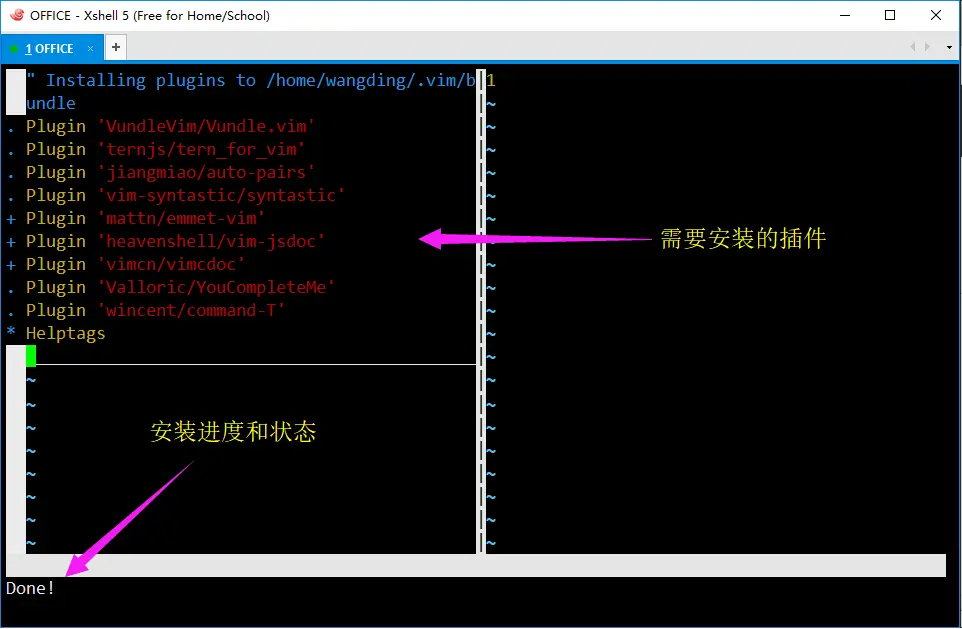

# 升级开发环境

Mocha 虚拟机开发环境，可以完成 Node.js 后端开发。下面的安装步骤将使这个开发环境具备前端开发能力。另外，Node.js 后端开发环境也需要进行升级。

在确保自己的虚拟机能上网的前提下，执行以下搭建前端开发环境的步骤：

## 更新 tools 仓库

```bash
cd
cd wd
rm -rf tools
git clone https://github.com/wangding/tools
```

## 安装 tools 仓库的 vim 配置文件

```bash
cd
cd wd/tools
cp .vimrc ~
```

## 安装 vim 插件

注意：**安装过程中，不要中途退出。一定要等 vim 提示 Done 后，才能退出。**
```
vim                // 命令行打开 vim 编辑器
:PluginInstall     // vim 的普通模式下，按冒号进入命令模式
                   // 输入 PluginInstall 命令，注意命令的大小写
:q                 // vim 提示 Done 时，:q 退出安装界面
:q                 // 退出 vim
```


## 验证安装的 emmet vim 插件

```
vim  a.html       // 命令行打开 vim 编辑器
i                 // 进入插入模式
!<ctrl>+y,        // 输入感叹号，然后同时按 ctrl 和 y 键，然后按逗号键
                  // vim 窗口中应该出现 HTML5 的页面框架代码
:q!               // 不保存退出
```

## 验证安装的 jsdoc vim 插件

```
vim  a.js            // 命令行打开 vim 编辑器
i                    // 进入插入模式
                     // 写一个 x + y 的 add 加法函数，代码如下
function add(x, y) {
  return x + y;
}
ESC                  // 退出插入模式，进入普通模式，移动光标到第一行
:JsDoc               // 按冒号进入命令模式，输入 JsDoc<回车>，注意命令大小写不要写错
                     // vim 窗口中应该出现函数头注释框架
:q!                  // 不保存退出
```

## 验证 CSS 代码补全功能

```
vim  a.css            // 命令行打开 vim 编辑器
i                     // 进入插入模式
                      // 写一个 body 的 CSS 样式代码，如下：
body {
  background:         // 注意在输入冒号和空格之后，应该弹出代码补全窗口
ESC                   // 回到普通模式
:q!                   // 不保存退出
```

## 验证代码注释工具

```
vi a.js               // 命令行打开 vim 编辑器
i                     // 进入插入模式，接下来，写六行代码
var name = 'wangding',
    qq   = '408542507',
    log  = console.log;

log(`name: ${name}`);
log(`qq  : ${qq}`);
ESC                   // 回到普通模式
                      // 上下移动光标到任意一行代码
<space>cc             // 按空格和两个 c 键，对当前行注释
<space>c<space>       // 按空格和 c 键以及空格键，取消当前行注释
<space>V              // 块选当前行
jj                    // 向下选中两行
<space>cc             // 对选中多行进行注释。取消注释，选中多行，按<space>c<space>
```

## 安装开发辅助工具

```bash
su                    // 切换到 root 账户
yum install -y tree   // 安装 Linux 命令行 tree 工具和语法高亮工具
npm i -g htmlhint     // 安装 HTMLHint 静态代码检查工具
npm i -g csslint      // 安装 CSSLint 静态代码检查工具
npm i -g eslint       // 安装 ESLint 静态代码检查工具
npm i -g browser-sync // 安装热加载工具
exit                  // 切换到开发者账户 wangding
```

## 验证 JavaScript 前端代码自动补全和后端代码补全
```
cd
mkdir spa
cd ~/spa
wget http://sample.wangding.co/nodejs/tern-project
mv tern-project .tern-project
vim  a.js             // 命令行打开 vim 编辑器
i                     // 进入插入模式
window.               // 输入 window 和点之后看到浏览器窗口对象 window 的方法提示
ESC                   // 回到普通模式
:q!                   // 不保存退出
vim  a.js             // 命令行打开 vim 编辑器
i                     // 进入插入模式
$.                    // 输入 $ 和点之后看到 jQuery 全局对象 $ 的方法提示
ESC                   // 回到普通模式
:q!                   // 不保存退出
vim  a.js             // 命令行打开 vim 编辑器
i                     // 进入插入模式
process.              // 输入 process 和点之后看到 node.js 全局对象 process 的方法提示
ESC                   // 回到普通模式
:q!                   // 不保存退出
```

## 安装 nvm 并升级 node.js 版本

```
curl -o- https://raw.githubusercontent.com/creationix/nvm/v0.33.11/install.sh | bash
```
上面的安装步骤结束后，编辑 .zshrc 文件，执行命令：`vi ~/.zshrc`。在 zshrc 文件的最后增加下面两行代码：
```
alias lrd="browser-sync start --server --port 8080 --no-open --files ."
alias pl="sudo firewall-cmd --zone=public --list-ports"
export NVM_DIR="$HOME/.nvm"
[ -s "$NVM_DIR/nvm.sh"   ] && \. "$NVM_DIR/nvm.sh"  # This loads nvm
```
保存 .zshrc 文件的修改，退出 vim。执行 linux bash 命令 `exit` 退出控制台，XShell 重新连接虚拟机。

升级 Node.js 版本到 10.16.3，执行下面的命令：
```
node -v               // 当前的 Node.js 版本应该是 6
nvm install 10
node -v               // 升级后 Node.js 版本应该是 10
``` 

## 验证开发辅助工具

```bash
tree ~/wd               // 应该看到 wd 目录的树状结构
htmlhint --version      // 应该看到版本号不低于：0.9.13
csslint --version       // 应该看到版本号不低于：v1.0.4
eslint --version        // 应该看到版本号不低于：v4.17.0
browser-sync --version  // 应该看到版本号不低于：2.23.6
```

# 掌握工具用法

## Vim 代码编辑器

1. 阅读 [Vim 笔记](http://note.wangding.co/office/vim.html)
2. 执行下列命令
```
cd                     // 回到家目录
git clone https://github.com/wangding/jsnotepad
tree jsnotepad         // 查看 jsnotepad 项目下的代码文件
```
3. 用 vim 打开 jsnotepad 项目中自己感兴趣的代码文件 html, css 或 js
4. win 10 浏览器窗口（查看 vim 笔记）和 XShell 终端窗口平铺，左边是笔记，右边是终端窗口
5. 对照左边文档，在终端窗口中练习 vim 的用法

## Emmet 工具

1. 安装 Emmet vim 插件，上面的开发环境搭建已经介绍过了
2. Emmet 工具在 vim 编辑器中的快捷键：**<ctrl>+y,**
3. Emmet 语法，请参考：https://docs.emmet.io/abbreviations/syntax/
4. Emmet vim 插件用法，请参考：https://github.com/mattn/emmet-vim/blob/master/TUTORIAL
5. 掌握 Emmet vim 常用的快捷键，<ctrl>+y，逗号，d，a，m，k，/，n
6. 创建一个 emmet.html 文件，在 vim 中打开此文件，练习 Emmet 插件的用法

## 静态代码检查工具

1. 安装静态代码检查工具，上面的开发环境搭建已经介绍过了
2. HTML 静态代码检查的规则，请参考：https://segmentfault.com/a/1190000013276858
3. CSS 静态代码检查的规则，请参考：https://github.com/CSSLint/csslint/wiki/Rules
4. JavaScript 静态代码检查的规则，请参考：http://eslint.cn/docs/rules/
5. 创建 HTML、CSS 和 JavaScript 三个代码文件，在 vim 中编辑代码，体验静态代码检查插件的用法

## 热加载工具

1. 安装热加载工具，上面的开发环境搭建已经介绍过了
2. 执行如下操作，掌握热加载工具的用法：  

```  
cd ~/spa        // 进入前端页面所在的目录  
lrd             // 运行热加载程序，热加载程序会启动一个 Web 静态文件服务  
                // 在 XShell 另一个控制台窗口编写代码
vi index.html
i               // 进入插入模式
!  ctrl + y,    // 产生 H5 页面框架代码
ESC             // 从插入模式回到普通模式
<space>w        // 同时按下空格和 w 键，保存代码
```

- 打开 win10 的 chrome 浏览器
- 输入热加载程序提示的 URL 地址
- chrome 浏览器中应该能看到刚才编写的页面代码
- 修改网页代码，保存，chrome 浏览器会自动刷新
- 通过热加载，浏览器能实时反映出页面的最新变化
- 不用手动刷新，提高开发效率
- 退出热加载按 Ctrl + C
